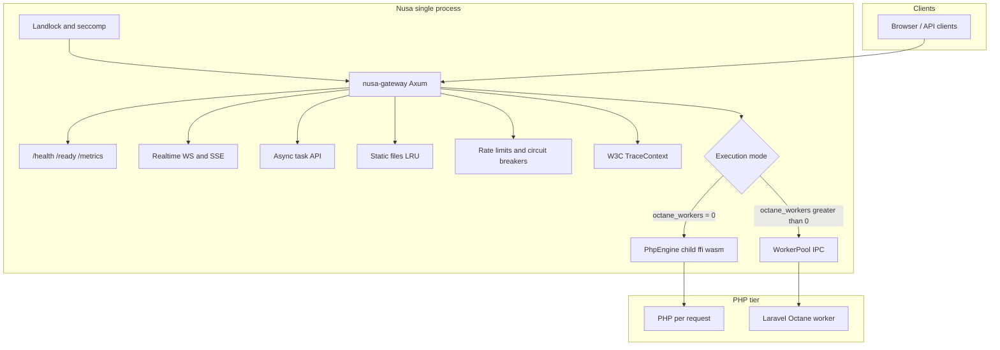

# Nusa PHP Runtime

**Where Rust’s discipline meets Laravel’s velocity.**

[](docs/public/production-status.md)
[](#license)
[](rust-toolchain.toml)

Nusa is a **Rust-orchestrated PHP runtime** for Laravel—not another php-fpm pool file behind nginx. One memory-safe control plane owns the network edge, concurrency, kernel sandboxing, observability, and multi-tenant guardrails. PHP remains the language of your application; Rust is the language of your **platform**.

> *Rust orchestrates. Laravel performs. The platform protects both.*

**Release line:** `0.1.0` (pre-GA). The engineering is real and deep; a short list of integration wires (chiefly Octane over HTTP) remains before v1.0. We say that openly below—because trust beats hype.

---

## Table of contents

- [Why Nusa exists](#why-nusa-exists)
- [How it works](#how-it-works)
- [What you get today](#what-you-get-today)
- [Production readiness](#production-readiness)
- [Quick start](#quick-start)
- [Configuration](#configuration)
- [Execution modes](#execution-modes)
- [HTTP surface](#http-surface)
- [Migration at a glance](#migration-at-a-glance)
- [PHP driver (Laravel bridge)](#php-driver-laravel-bridge)
- [Workspace architecture](#workspace-architecture)
- [Develop and verify quality](#develop-and-verify-quality)
- [Security](#security)
- [Documentation map](#documentation-map)
- [License](#license)

---

## Why Nusa exists

For twenty years, Laravel teams have shipped brilliant application code on stacks that split responsibility in the wrong places: nginx configs here, FPM pools there, Supervisor elsewhere, security through `php.ini` hope, metrics bolted on last. **Nusa inverts that.**

| Legacy pain | Nusa answer |
|-------------|-------------|
| Many moving parts at the edge | **One `nusa` binary** — gateway + supervision + policy |
| Security as ini folklore | **Landlock + seccomp** applied before `listen()` |
| Octane = second product to operate | **Worker pool + framed IPC** inside the same runtime |
| Multi-tenant = custom middleware soup | **Per-tenant rate limits and circuit breakers** in gateway state |
| Observability retrofitted | **`/metrics`, structured logs, W3C TraceContext** built in |
| Config scattered across layers | **`nusa.toml` + `NUSA_*` env**, hot reload via `ArcSwap` |

You keep **Laravel, Composer, routes, and Eloquent**. You gain a control plane as serious as the Go or Rust services beside you in the cluster—without asking developers to stop writing PHP.

---

## How it works



**At a glance:**

```
  Clients ──► Nusa Gateway (Rust / Axum)
                 │
                 ├─ Normal mode  ──► PhpEngine ──► PHP (child / ffi / wasm)
                 ├─ Octane mode  ──► WorkerPool ──► IPC ──► octane-rust-worker
                 │
                 ├─ Landlock + seccomp (before accept)
                 ├─ Tenant limits + global/per-tenant circuit breakers
                 └─ /health · /ready · /metrics · /ws · /sse · /api/tasks
```

---

## What you get today

These are **implemented and tested** (including Alpine musl CI), not slide-deck promises.

### HTTP gateway (`nusa-gateway`)

- Full **Axum** application edge: routing, middleware, timeouts, backpressure aligned with `max_workers`
- **Health & readiness** probes for Kubernetes and load balancers
- **Prometheus** metrics at `GET /metrics`
- **Static file serving** with caching, MIME types, traversal hardening
- **WebSocket** and **SSE** managers for real-time Laravel features
- **Async task offload** (`POST /api/tasks`, status polling)
- **Global and per-tenant circuit breakers**
- **Per-tenant rate limiting**
- **Request size limits** and upstream timeout enforcement
- **W3C TraceContext** extraction for distributed tracing
- **Tenant identity** from `X-Tenant-Id` and host subdomains
- Modules for **TLS / ACME / QUIC** (environment-dependent activation)

### PHP execution

| Engine | Role |
|--------|------|
| **`child`** (default) | Governed PHP subprocesses — **supported production path for Normal mode** |
| **`ffi`** | Embedded PHP on Linux when you control ZTS/embed builds |
| **`wasm`** | Sandboxed PHP research path — **CLI uses stub today, not production PHP** |

### Kernel sandbox (`nusa-security`)

- **Landlock** filesystem rules on `code_dir` and `tmp_dir`
- **Seccomp-BPF** syscall filtering before traffic is served
- Linux enforcement tests in **Alpine CI fail closed** — no silent skip

### Octane subsystem (`nusa-octane-worker` + `nusa-ipc`)

- **Worker pool** sizing via `octane_workers`
- **Framed IPC**: handshake, heartbeat, request/response
- **Worker recycle** by memory and request budgets
- **State reset orchestrator** for long-lived worker hygiene
- **`php-driver`** Composer package with `octane-rust-worker` entrypoint

### Platform ergonomics

- **Hot-reload config** without dropping the listener (`ArcSwap`)
- **Structured JSON logging** (`tracing`) — `nusa dev --pretty` for local humans
- **Plugin registry** hook surface for extensions
- **Large test corpus**: security, concurrency, gateway E2E, IPC stress — gated by `just podman-ci`

---

## Production readiness

We will not badge this as GA until benchmarks and release process say so. Here is the honest matrix:

| Question | Answer |
|----------|--------|
| Is the architecture production-grade in design? | **Yes** |
| Can I bet unlimited customer traffic on v0.1.0 today? | **Not yet** |
| Best path for pilots? | **`engine = child`**, `octane_workers = 0` on Linux/Alpine |
| Authoritative quality gate? | **`just podman-ci`** (musl), not host-only `just ci` |

**Active milestone (P1):** when `octane_workers > 0`, the CLI initializes the worker pool, but the **HTTP handler still calls `engine.execute` only** until gateway dispatch to the pool ships. `/ready` does not yet fail closed if the pool is required but unhealthy. Plan Octane staging for **IPC and worker validation** until P1 is verified in your environment.

| Works today | Finishing next |
|-------------|----------------|
| Normal mode HTTP → `PhpEngine` | HTTP → `WorkerPool` when Octane enabled (P1) |
| Pool init, IPC, state reset | Readiness tied to pool health (P1) |
| Landlock + seccomp on Linux | Laravel fixture E2E in default CI (P2) |
| Metrics, WS, SSE, tasks API | GA benchmarks + signed release (P3–P4) |

Deep dive: [docs/public/production-status.md](docs/public/production-status.md).

---

## Quick start

### Prerequisites

- **Rust** 1.95+ ([`rust-toolchain.toml`](rust-toolchain.toml))
- **PHP 8.x** for child engine and Octane workers
- **Linux** recommended for sandbox parity; **Podman/Docker** for CI-accurate tests

### Build and run

```bash
git clone https://github.com/nusa-rs/nusa.git
cd nusa

cp config.toml.example nusa.toml
# Edit code_dir, vfs_root, tmp_dir for your Laravel tree

cargo build -p nusa-cli --release
cargo run -p nusa-cli -- --config nusa.toml
```

Binary name: **`nusa`** (crate `nusa-cli`).

### Verify the edge

```bash
curl -s http://localhost:8080/health    # liveness
curl -s http://localhost:8080/ready     # readiness
curl -s http://localhost:8080/metrics   # Prometheus
```

Hit your app routes (`/`, `/api/...`) to exercise PHP through the gateway.

### Local development with hot reload

```bash
cargo run -p nusa-cli -- dev --pretty
```

Watches `app/`, `config/`, `routes/`, `resources/views/`, `.env` by default.

### Run tests like CI (recommended before you trust a fork)

```bash
just podman-build
just podman-ci
```

---

## Configuration

Single file **`nusa.toml`** (or `--config path`), overridden by **`NUSA_*`** environment variables — ideal for Kubernetes without templating PHP.

| Key | Default | Meaning |
|-----|---------|---------|
| `engine` | `child` | `child` \| `ffi` \| `wasm` |
| `max_workers` | `4` | Gateway concurrency / backpressure (must be > 0) |
| `timeout_ms` | `30000` | Per-request upstream timeout |
| `code_dir` | `/app/public` | Laravel root — **Landlock code rules** |
| `vfs_root` | `/app/public` | Script / public resolution |
| `tmp_dir` | `/tmp/nusa` | Writable enclave — **Landlock tmp rules** |
| `hot_reload` | `true` | Atomic in-process config swap |
| `octane_workers` | `0` | `0` = Normal; `> 0` = persistent worker count |
| `octane_max_memory_mb` | `512` | Recycle worker after memory |
| `octane_max_requests` | `1000` | Recycle worker after requests |

Example — **conservative production pilot:**

```toml
engine = "child"
max_workers = 8
timeout_ms = 30000
code_dir = "/app"
vfs_root = "/app/public"
tmp_dir = "/tmp/nusa"
hot_reload = true
octane_workers = 0
```

Full reference: [docs/public/configuration.md](docs/public/configuration.md) · example: [`config.toml.example`](config.toml.example).

---

## Execution modes

### Normal mode — FPM-compatible discipline

`octane_workers = 0`. Each request flows:

```
Gateway → PhpEngine::execute(RequestContext) → PHP → HTTP response
```

Strong isolation, familiar operations, **supported for production pilots today**.

### Octane mode — Laravel warm, platform cold

`octane_workers > 0`. Persistent workers, IPC, recycle policy, state reset — the throughput story RoadRunner users expect, **embedded in Nusa** instead of a second binary to operate.

**v0.1.0:** pool and protocol are real; **HTTP entry into the pool** is the P1 wire-up. See [getting started](docs/public/getting-started.md).

---

## HTTP surface

| Method / path | Purpose |
|---------------|---------|
| `GET /health` | Liveness |
| `GET /ready` | Readiness |
| `GET /metrics` | Prometheus exposition |
| `GET /ws` | WebSocket upgrade |
| `GET /sse` | Server-Sent Events |
| `POST /api/tasks` | Async task enqueue |
| `GET /api/tasks/{id}/status` | Task status |
| `GET /static/{*path}` | Static assets (cached, hardened) |
| `GET\|POST /{*path}` | Application catch-all → PHP handler |

**Not implemented:** `/admin/recycle-all` (do not expect RR-style HTTP admin recycle yet; use config recycle limits when Octane HTTP path is live).

---

## Migration at a glance

| From | Nusa approach |
|------|----------------|
| **PHP-FPM + nginx** | Single `nusa` process; `max_workers` instead of `pm.max_children`; probe `/health` and `/ready` |
| **RoadRunner / FrankenPHP** | `octane_workers` + `nusa/php-driver`; same runtime owns HTTP and workers — verify P1 before throughput claims |
| **Security = ini only** | Landlock + seccomp; audit `storage/` and cache paths against `tmp_dir` |

Step-by-step: [docs/public/migration.md](docs/public/migration.md) · operations: [docs/public/operations/runbook.md](docs/public/operations/runbook.md).

---

## PHP driver (Laravel bridge)

Composer package **`nusa/php-driver`** (`php-driver/`) connects Laravel bootstrap to Rust orchestration:

```
php-driver/
├── composer.json
├── bin/octane-rust-worker   # IPC worker entry
└── src/
```

Path repository during development:

```json
{
  "repositories": [{ "type": "path", "url": "../php-driver" }],
  "require": { "nusa/php-driver": "@dev" }
}
```

Details: [docs/public/ecosystem/package-guidelines.md](docs/public/ecosystem/package-guidelines.md).

---

## Workspace architecture

| Crate | Responsibility |
|-------|----------------|
| `nusa-gateway` | Axum HTTP, middleware, WS/SSE, static, health, metrics |
| `nusa-core` | Request context, VFS, tasks, guards |
| `nusa-engine-child` | PHP subprocess engine (**default**) |
| `nusa-engine-ffi` | Embedded PHP (isolated `unsafe` + `// SAFETY:`) |
| `nusa-engine-wasm` | WASM sandbox path (forward-looking) |
| `nusa-octane-worker` | Worker pool, spawn, state reset |
| `nusa-ipc` | Framed binary IPC protocol |
| `nusa-config` | TOML + env, hot reload |
| `nusa-security` | Landlock, seccomp |
| `nusa-telemetry` | Metrics and export |
| `nusa-plugin-api` | Plugin registry |
| `nusa-cli` | **`nusa`** binary — `dev`, `test`, `deploy`, `rollback` |
| `nusa-benchmarks` | Criterion benches (`just bench`) |

Contributor map: [docs/contributor/crate-map.md](docs/contributor/crate-map.md) · request flow: [docs/contributor/architecture.md](docs/contributor/architecture.md).

---

## Develop and verify quality

| Task | Command |
|------|---------|
| Format | `just fmt` |
| Lint (deny warnings) | `just lint` |
| Fast tests (host) | `just test-fast` |
| Single crate | `just test-crate gateway` |
| **Pre-merge CI (authoritative)** | **`just podman-ci`** |
| Full container tests | `just podman-test-full` |
| Live PHP scenarios | `just podman-test-live` |
| Release binary | `just build-release` |
| Static musl binary | `just build-musl` |
| Benchmarks | `just bench` / `just bench-fast ipc_latency_bench` |
| API docs | `just docs` |

Standards: [CONTRIBUTING.md](CONTRIBUTING.md) · [`.cursor/rules/nusa-standards.mdc`](.cursor/rules/nusa-standards.mdc) · testing: [docs/contributor/testing.md](docs/contributor/testing.md).

---

## Security

- `#![deny(unsafe_code)]` workspace-wide except **`nusa-engine-ffi`** with documented `// SAFETY:` comments
- Threat model: [docs/security/threat-model.md](docs/security/threat-model.md)
- Compliance mapping: [docs/security/compliance.md](docs/security/compliance.md)
- **Report vulnerabilities:** [SECURITY.md](SECURITY.md) — please do not open public issues for security flaws

---

## Documentation map

Most visitors read only this file—so it is complete. When you deploy, bookmark the deeper guides.

| Audience | Link |
|----------|------|
| **Operators & Laravel teams** | [docs/public/](docs/public/) — vision, config, migration, runbook |
| **Contributors** | [CONTRIBUTING.md](CONTRIBUTING.md) → [docs/contributor/](docs/contributor/) |
| **AI agents (Cursor)** | [AGENTS.md](AGENTS.md) → [docs/ai/](docs/ai/) |
| **Full index** | [docs/README.md](docs/README.md) |

| Essential deep dives | |
|----------------------|--|
| Production truth | [docs/public/production-status.md](docs/public/production-status.md) |
| Getting started | [docs/public/getting-started.md](docs/public/getting-started.md) |
| Configuration | [docs/public/configuration.md](docs/public/configuration.md) |
| Migration | [docs/public/migration.md](docs/public/migration.md) |
| Operations runbook | [docs/public/operations/runbook.md](docs/public/operations/runbook.md) |

---

## Closing thought

Nusa exists because **Laravel deserves a platform boundary as rigorous as the frameworks beside it in the cluster**—without forcing developers to leave PHP. The runtime is young on the calendar and **advanced in the engineering that survives production contact**: sandbox enforcement, gateway richness, IPC, and tests measured in thousands of cases, not dozens.

Try it in staging. Read [production status](docs/public/production-status.md) before you bet the business. When P1 lands, the same binary you pilot today becomes the Octane story you migrated for—without giving up observability, tenancy, or kernel policy.

**Rust orchestrates. Laravel performs. The platform protects both.**

---

## License

MIT — see workspace `Cargo.toml`.
