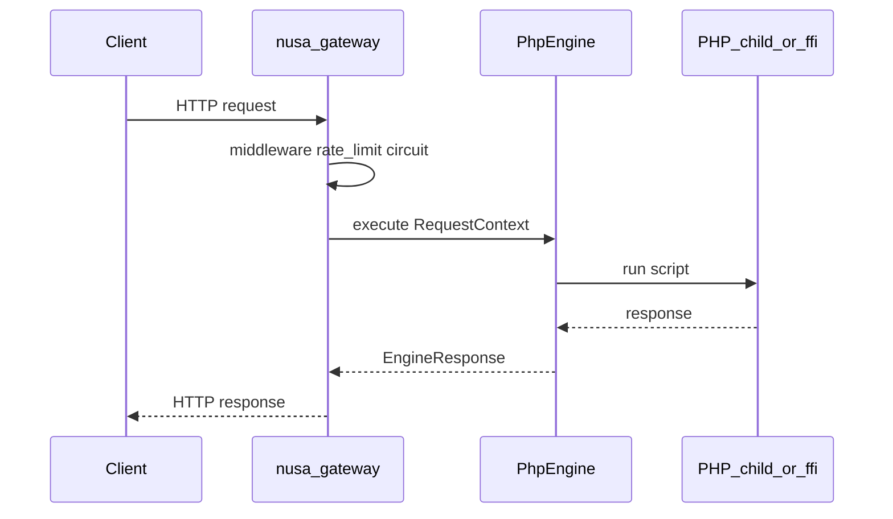
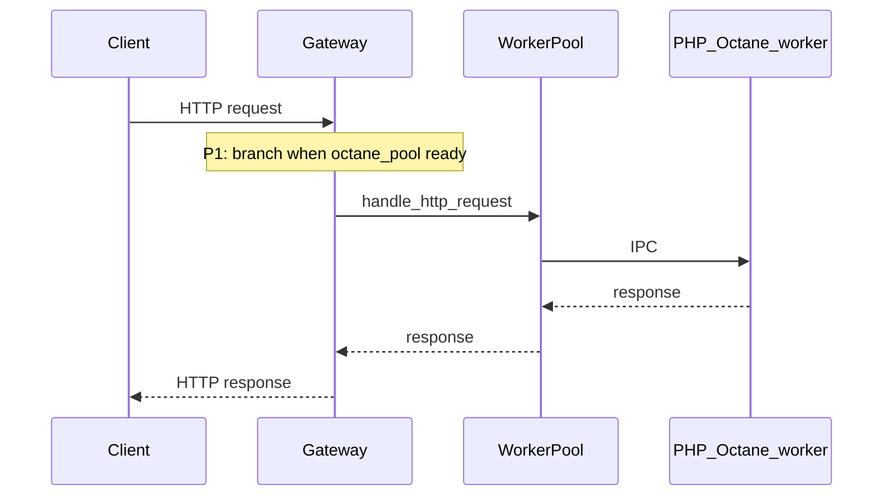

# Architecture

High-level design of Nusa PHP Runtime v0.1.0.

## Request path (Normal mode)

Entry: [`crates/nusa-gateway/src/lib.rs`](../../crates/nusa-gateway/src/lib.rs) `handler` → `state.engine.execute(ctx)`.

## Request path (Octane — intended, incomplete)

Today: pool may be initialized in CLI [`main.rs`](../../crates/nusa-cli/src/main.rs) but gateway still uses **engine.execute** only.

## Process lifecycle (CLI)

1. Telemetry init
2. Load config (`nusa-config`, hot reload)
3. Construct `PhpEngine` from `engine` kind
4. Apply Landlock + seccomp (`nusa-security`)
5. Build gateway `AppState` (plugins, circuit breakers, tenants, tasks, WS, SSE, metrics, **octane_pool**)
6. `axum::serve`

## Major components

| Layer | Crate | Role |
|-------|-------|------|
| Edge | `nusa-gateway` | HTTP, WS, SSE, static, health, metrics |
| Domain | `nusa-core` | Request context, VFS, tasks, guards |
| Execution | `nusa-engine-child`, `nusa-engine-ffi`, `nusa-engine-wasm` | `PhpEngine` trait |
| Workers | `nusa-octane-worker`, `nusa-ipc` | Persistent Laravel workers |
| Policy | `nusa-security` | Landlock, seccomp |
| Config | `nusa-config` | TOML + env |
| Observability | `nusa-telemetry` | Metrics, tracing export |
| Plugins | `nusa-plugin-api` | Extension registry |
| Binary | `nusa-cli` | `nusa` command |

## Multi-tenancy

`TenantRegistry`, per-tenant rate limits, and tenant circuit breakers live in gateway state. Requests carry tenant identity in `RequestContext` when configured.

## Async tasks

`POST /api/tasks` offloads work via `nusa-core` `TaskManager` — separate from synchronous PHP page handling.

## Deployment artifacts

- **CI/test image:** `dockerfiles/nusa-test-runner.Dockerfile`
- **Alpine variant:** `dockerfiles/nusa-test-alpine.Dockerfile`
- **Benchmarks:** `benches/` (`nusa-benchmarks`)

## Related docs

- [crate-map.md](crate-map.md)
- [Public production status](../public/production-status.md)
