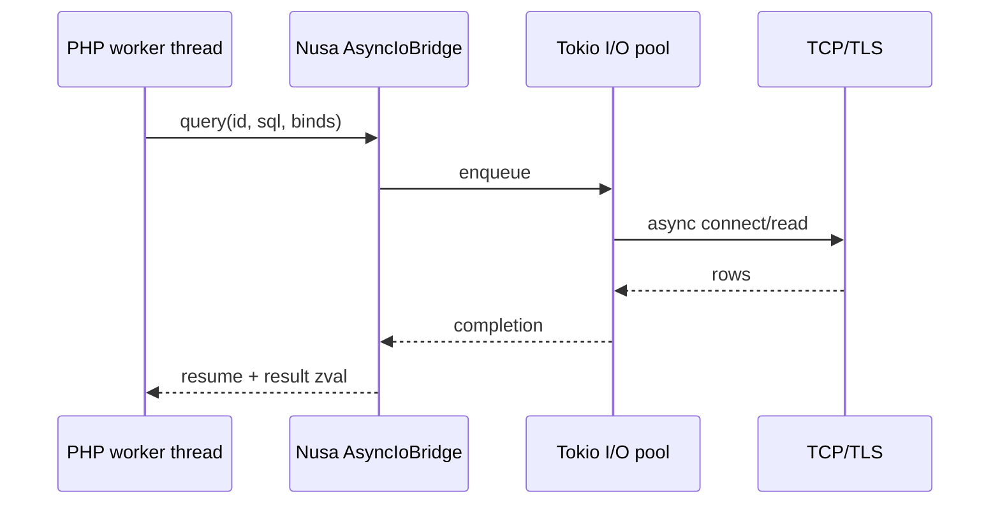

# Spike: P4-D transparent async I/O offload

**Status:** Spike — Rust `SELECT 1` round-trip + Laravel blocking `/nusa-db-ping` (PHP proxy TBD)  
**RFC:** [nusa-native-laravel-runtime.md](../rfc/nusa-native-laravel-runtime.md) § P4-D

## Problem

Octane workers block on PDO, HTTP clients, and Redis while the Rust gateway could run I/O concurrently. Bun-style runtimes keep the event loop outside user code; Nusa owns the loop in Rust (RFC north star: Bun-tier I/O concurrency, not FrankenPHP parity).

## Target UX (developer)

```php
// Unchanged Laravel code
$user = User::find(1);
$response = Http::get('https://api.example.com/health');
```

Behind the scenes (when `NUSA_ASYNC_IO=1` and bridge registered):

1. PDO/HTTP call marshals to Rust async pool.
2. PHP worker parks (Octane-style) without holding OS thread on socket wait.
3. Result injected back into Zend before next opcode.

## Architecture (proposed)



## Crates (future)

| Crate | Role |
|-------|------|
| `nusa-core::async_io` | Trait + registry (`bridge_from_env`) |
| `nusa-async-pdo` (new) | PDO driver proxy, channel protocol |
| `nusa-gateway` | Optional metrics: parked workers, queue depth |

## Risks

| Risk | Mitigation |
|------|------------|
| Transaction semantics | Stay on blocking PDO until proxy proves savepoints |
| Lazy Eloquent | Integration tests per relation pattern |
| Extension PDO replacements | Opt-in per driver; document unsupported |
| Debugging | `nusa trace` shows parked vs active I/O |

## Spike deliverables (this repo)

- [`crates/nusa-core/src/async_io.rs`](../../crates/nusa-core/src/async_io.rs) — `AsyncIoBridge`, `NoopAsyncIoBridge`, `SpikeSqliteAsyncIoBridge`
- `NUSA_ASYNC_IO=stub` — read-only SQL via `execute_readonly_sql` + `spawn_blocking`; optional `NUSA_ASYNC_SQLITE_PATH`
- `NUSA_ASYNC_IO=1` — reserved; warns (no bridge) until PHP proxy lands
- Laravel [`/nusa-db-ping`](../../tests/fixtures/laravel-minimal/routes/web.php) — blocking PDO baseline
- Embed NEB1 **op 6/7** — [`/nusa-async-spike`](../../tests/fixtures/laravel-minimal/routes/web.php), [`/nusa-async-sql`](../../tests/fixtures/laravel-minimal/routes/web.php)
- This document

## Laravel PDO proxy (spike)

When `NUSA_ASYNC_IO=stub` and `NUSA_EMBED_TRANSPORT=frame`:

- [`NusaAsyncSqliteConnection`](../../php-driver/src/Embed/Database/NusaAsyncSqliteConnection.php) overrides `select()` for read-only SQL without bindings.
- [`AsyncIo`](../../php-driver/src/Embed/AsyncIo.php) registers the sqlite resolver before kernel boot; sets `NUSA_ASYNC_SQLITE_PATH` from Laravel config.
- Fixture route: `GET /nusa-db-async-proxy` — `DB::selectOne('SELECT 2 AS two')`.

Queries with bindings fall back to blocking PDO.

## Next experiments

1. Bound parameters + transaction semantics.
2. JSON transport async messages (dev fallback).
3. KPI: worker parked % under wrk with artificial 50ms network delay.

## Non-goals (spike)

- Full Eloquent driver rewrite.
- Default-on in production image.
